# The main addon description is written below:

**Things to check out:**

+ CS:GO Ports of all Modern Warfare 2019 Weapons - [Click](https://github.com/crazyslavmodder/CSGO-MW2019-Weapons-RELEASE)
+ CS:GO/SO Ports of Black Ops:Cold War Weapons - [Click](https://github.com/ZaihnDT/MIGI-BOCW-Weapons)
+ Public Modern Warfare Files for Source Engine, Useful! - [Click](https://github.com/One-Trick-Viper/Source-Files-MW-Public)
+ Modern Warfare Base Materials Tool - [Click](https://github.com/mushroom-guy/mwb-materials)
+ ARC9, a successor to the ArcCW - [Click](https://github.com/HaodongMo/ARC-9)
+ ARC9 Call of Duty: Modern Warfare 2019 - [Click](https://github.com/curlySparkle/ARC9-COD2019)
+ ARC9 Call of Duty: Modern Warfare Shared - [Click](https://github.com/CurlySparkle/ARC9_Cod2019_Shared)

**Credits and shoutouts:**

+ Infinity Ward/Treyarch/Sledgehammer - Call Of Duty Modern Warfare (XIX, II, III) Assets;
+ Scobalula - Greyhound, Parazyte;
+ Ma_rv, Mushroom Guy - Textures to VTF Converters;
+ Stomatolog, Stefano - Ripping Assets;
+ Stomatolog, Lutzz - Help with CS:GO/CS:SO ports;
+ Viper, Mushroom Guy - Help with MW Base ports;
+ Arctic, Twilight Sparkle - Help with ARC-9 COD2019 Pack ports.

---

### [MWB] This attachment pack adds all STB 556, MX9 and HCR 56 parts to MW19 AUG. You can only use those together, please don't try to break this system. You can use attachments such as Lasers, Grips, Sights and Muzzle Devices from MWXIX though.

### [ARC9] This version adds STB 556 and it's weapon-specific attachments, you need to have Cod2019 pack installed to access it's attachments.

---

---

**The STB 556 is a weapon featured in Call of Duty: Modern Warfare 2 (2022), it is one of the Assault Rifles available in the game.**

**The STB 556 was released in Modern Warfare 2 with the launch of the game on October 28, 2022, and on Warzone 2 when the game releases on November 16, 2022, along with Season One.**

**The design of the STB 556 is based the real-life gun AUG A3.**

**The STB 556 is part of the Bruen Bullpup Platform family of weapons.**

---

---

**The MX9 (AUG) is a weapon featured in Call of Duty: Modern Warfare 2 (2022), it is one of the SMGs available in the game.**

**The MX9 (AUG) was released in Modern Warfare 2 with the launch of the game on October 28, 2022, and on Warzone 2 when the game releases on November 16, 2022, along with Season One.**

**The design of the MX9 (AUG) is based the real-life gun Steyr AUG Para.**

**The MX9 (AUG) is part of the Bruen Bullpup Platform family of weapons.**

---

---

**The HCR 56 is a weapon featured in Call of Duty: Modern Warfare 2 (2022), it is one of the LMGs available in the game.**

**The HCR 56 was released in Modern Warfare 2 with the launch of the game on October 28, 2022, and on Warzone 2 when the game releases on November 16, 2022, along with Season One.**

**The design of the HCR 56 is based the real-life gun Steyr AUG HBAR.**

**The HCR 56 is part of the Bruen Bullpup Platform family of weapons.**

---

## Other Releases Include:

+ Multiple items_game.txt Includer Add-ons
+ Source Offensive Replacement Add-ons
+ Modern Warfare Base Attachment Packs
+ ARC9 Cod2019 Pack Additions

## Screenshot Gallery:

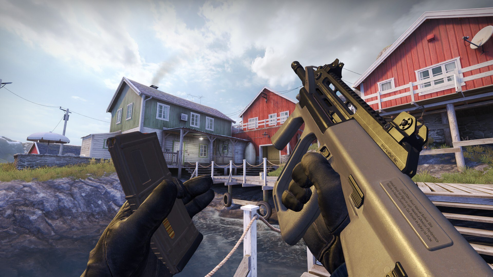

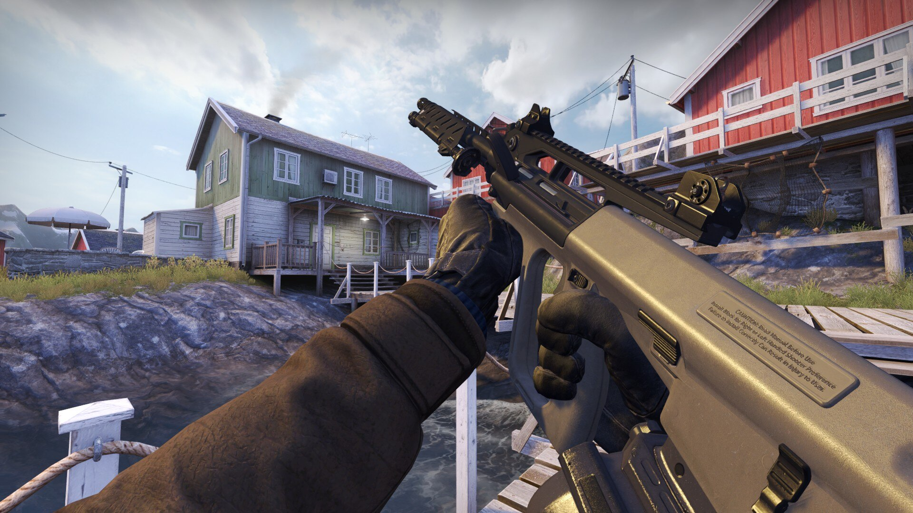

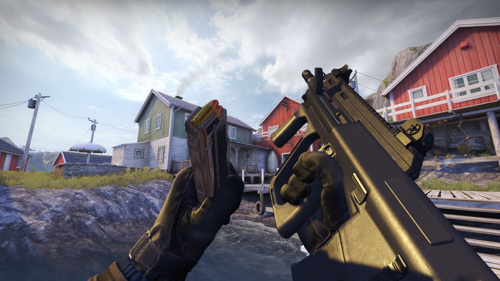

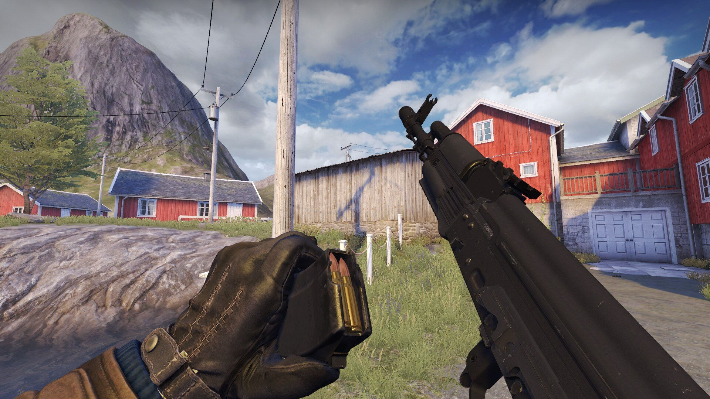

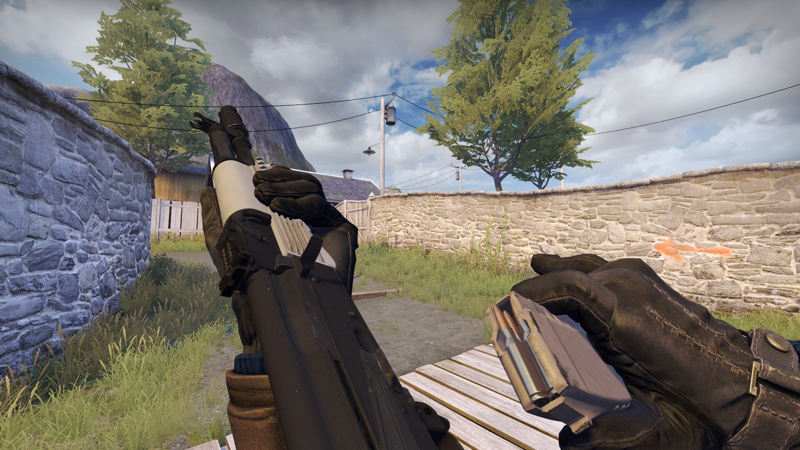

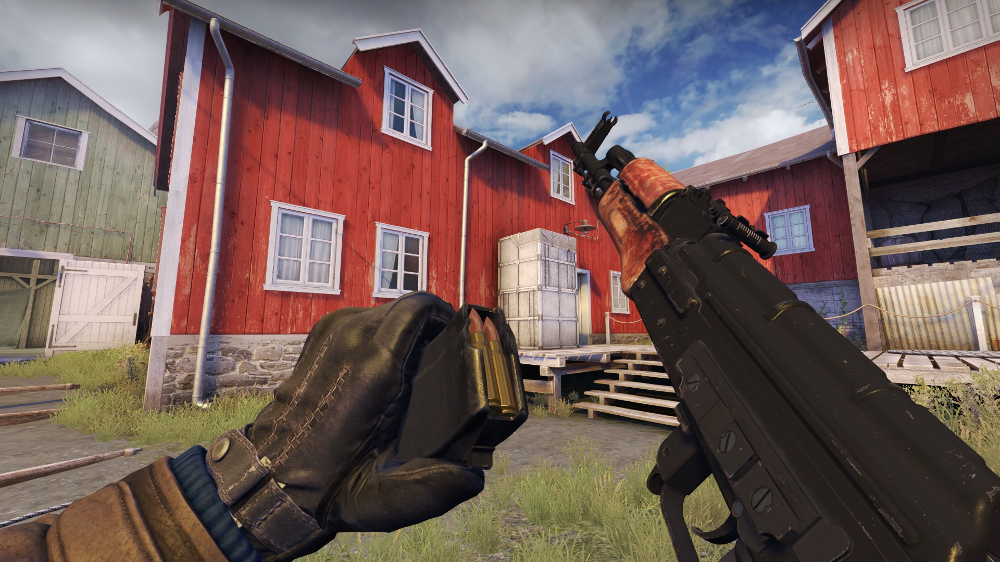

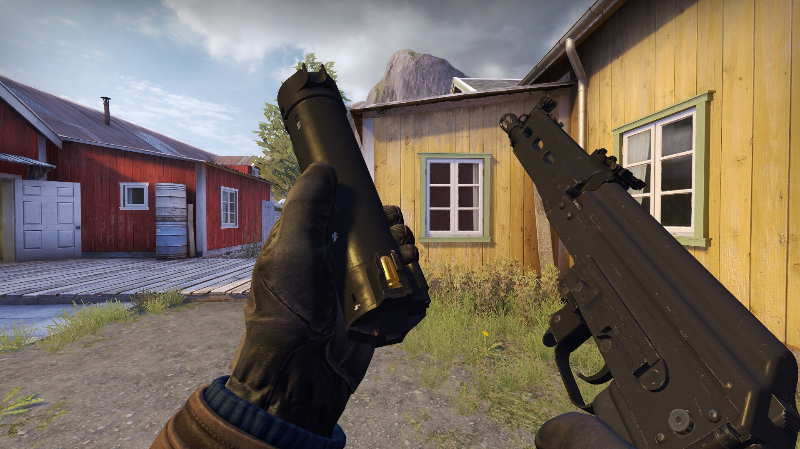

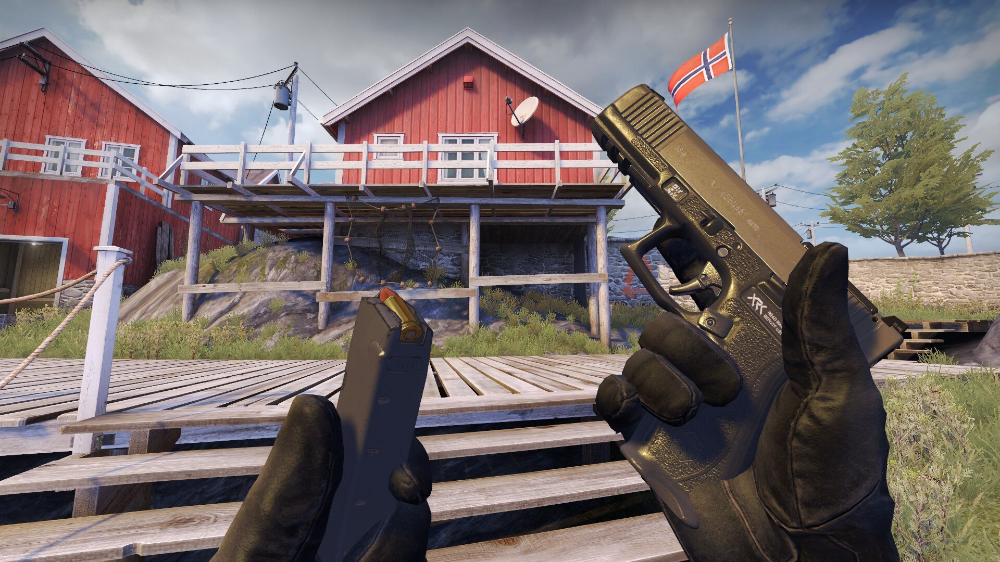

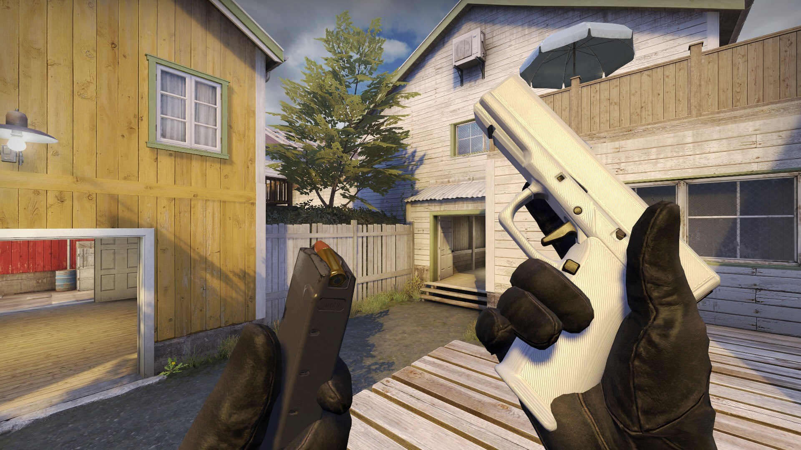

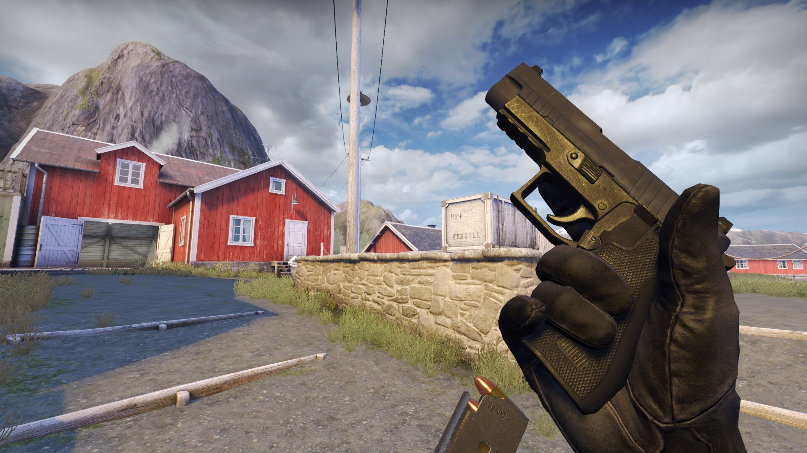

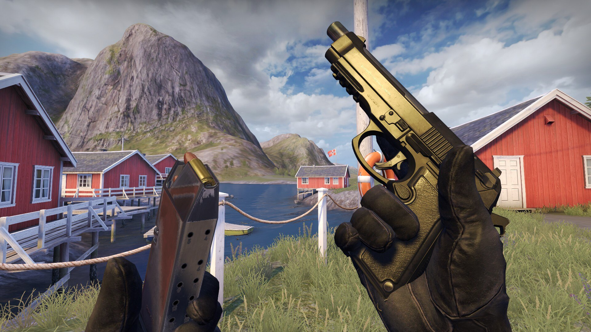

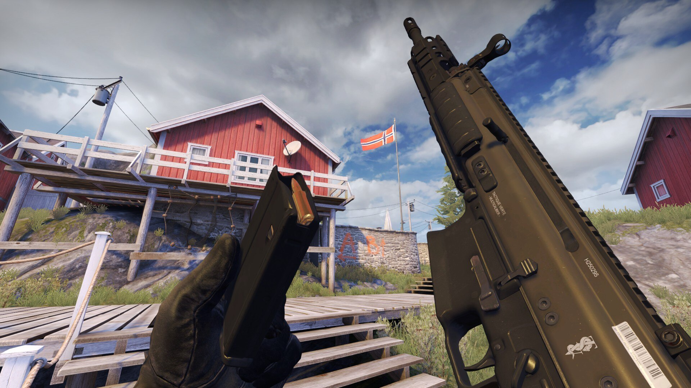

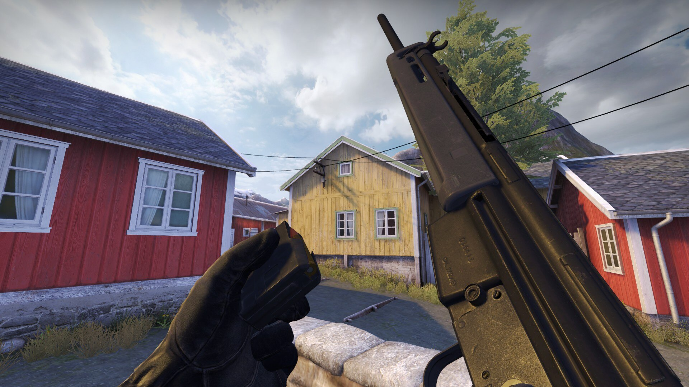

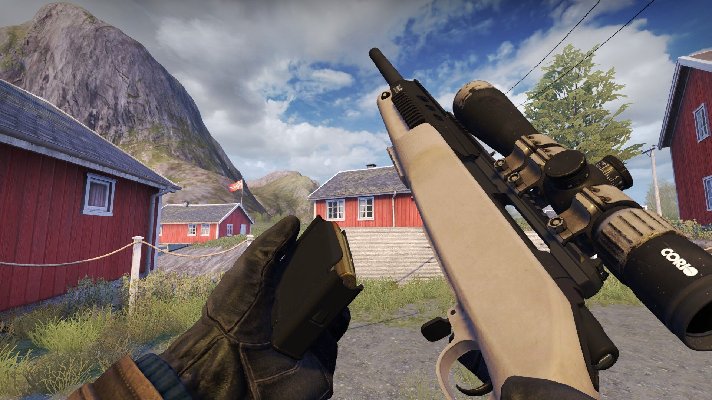

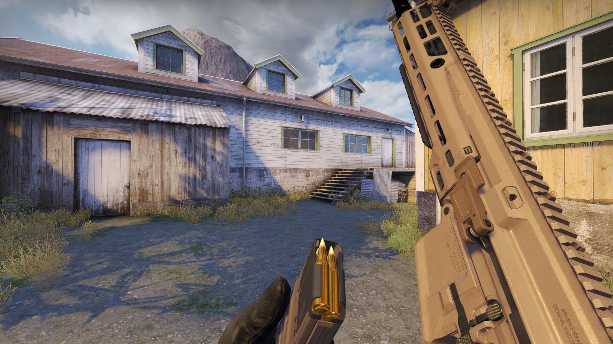

---
